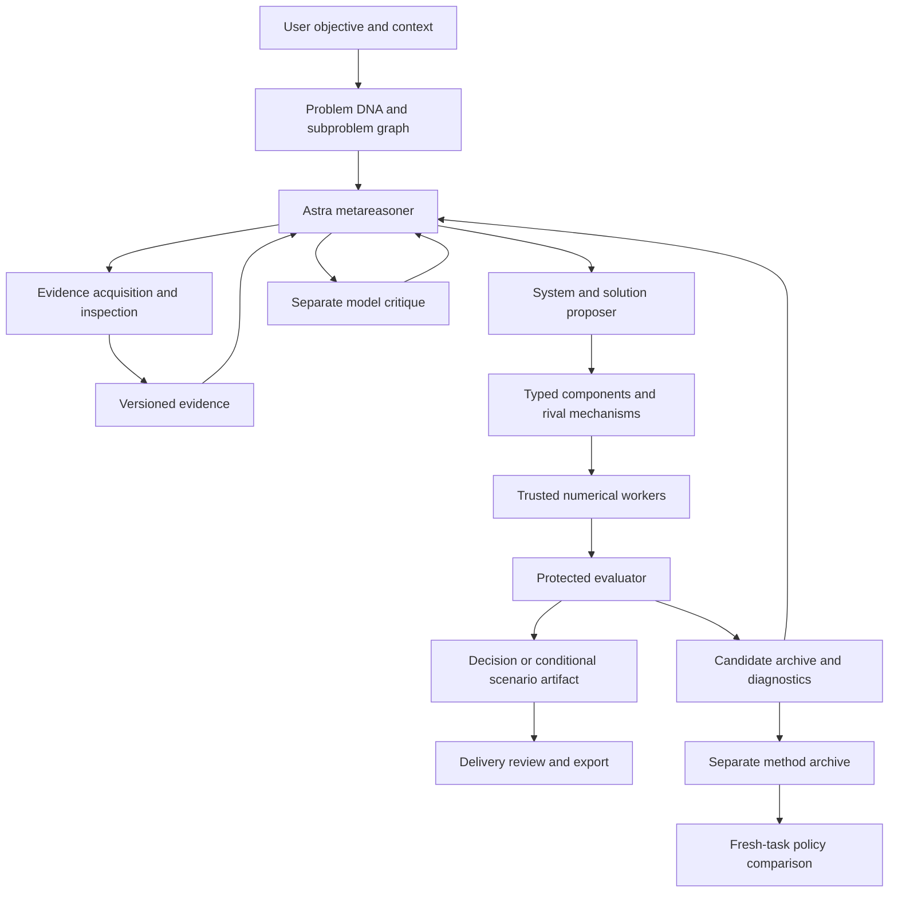

# Symplex architecture

The core artifact is a solution assembly bound to a versioned problem and a decision contract. It includes the problem decomposition, assumptions, evidence entitlements, system representation, component graph, supported execution plan, evaluator and consumption interface. It must preserve the difference between a proposed mechanism, an executed computation, an empirical comparison and a useful real-world outcome.

## User journey

1. Describe a problem in ordinary language; no dataset selection is necessary.
2. Attach local context, evidence or explicit assumptions. Optional GeoJSON is one artifact type, not a universal requirement.
3. Launch the agent with a bounded investigation depth.
4. Inspect the agent's changing problem graph, evidence, rival mechanisms and model designs.
5. Inspect actual runs and explore conditional what-if changes.
6. Review result-linked decisions, limitations, reversal conditions and exportable components.

Chat is a persistent conversation. The autonomous solver is a separate explicit action. Each tool invocation becomes a persistent action/result pair. Evidence and model critique can lead back to problem or model revision; the five UI stages describe views, not a mandatory one-pass pipeline.

## Execution authority

The provider cannot edit the evaluator, labels, split allocation, execution permissions, budget caps or audit seals. It emits typed proposals. The host dispatches a closed tool menu. Source content has no execution authority. No local arbitrary shell is exposed to the solver. A separate hosted Python tool lets Astra author and execute models in the provider sandbox and return code, diagnostics and visual files.

## Component families

The architecture admits observed-data adapters, probabilistic components, symbolic constraints, dynamic-system simulators, fitted models, solvers and delivery components. They require compatible meaning, units, timing, target, preprocessing and resource entitlements. API models and local checkpoints have different capabilities; an API component has no accessible weights to merge.

Implemented numerical families are currently narrow: P1 probability constraints and calibration, and a general bounded stochastic influence graph. Other physical, biological, geospatial and learned model backends need separate implementation and validation. The model registry must not mark a library installation as a tested scientific adapter.

## Evolution, metareasoning and method revision

P1 evolution selects a parent, asks Astra for a bounded mutation, compiles a trusted genome, executes the whole candidate, scores development observations and updates a descriptor archive. Failed and losing branches remain inspectable. The descriptor axes are coupling and observation classes; unsupported cells remain empty. No posterior interpretation is attached to cell occupation.

The general solver chooses evidence, system design, scenario execution, critique or delivery based on returned artifacts. A deeper investigation increases permitted actions/revisions, while global caps remain unchanged. An individual workflow can still stop early because more computation is unlikely to resolve missing evidence.

The optional research-policy pilot keeps method revisions separate from model genomes. It proposes a diagnostic-order toggle from development traces, compares frozen parent and child on a separate question, retains the parent on a tie, then audits on another question. This is a small integration demonstration, not evidence of general RSI. There is no global self-modification of the evaluator or execution harness.

## Persistence and reproducibility

SQLite holds record identities, parent links, timestamps, staleness, jobs, budget reservations and audit seals. Artifacts are keyed by a canonical JSON SHA-256 digest and checked on read. Run metadata includes data/program/protocol references, outputs and cost. Repeated logical jobs reuse their identity. A revised assumption creates a new version and marks descendants of the prior problem stale.

A numerical rerun reproduces deterministic templates and common random streams. It does not reproduce stochastic LLM generation. API usage and failures are persisted separately. A daemon thread provides local background execution; process crashes do not recover an active SDK request or automatically resume every tool checkpoint. Production durability requires a resumable workflow backend and lease/heartbeat recovery.

## Boundaries needing a next implementation

- Specialist scientific containers with governed package installation, GPU resources and pinned native dependencies beyond the implemented hosted Python backend.
- Real domain datasets, domain-specific admission, pinned asset retrieval and independent empirical checks.
- Calibrated uncertainty, physical conservation invariants where applicable, observation/noise models linked to measurements, and causal intervention validation.
- Richer clarification UX and multi-party judgment capture beyond the implemented persisted ask/steer/resume loop.
- True execution entitlements across cached artifacts, dataset revisions and task families; distributed cancellation and replay.
- Fine-grained lineage with multiple parent edges, operational monitoring and external human domain review.
- Production identity, authorization, tenant isolation and audit retention controls.

The initial product demonstrates the software path while exposing these gaps. Its release description must remain narrower than the full design ambition.
