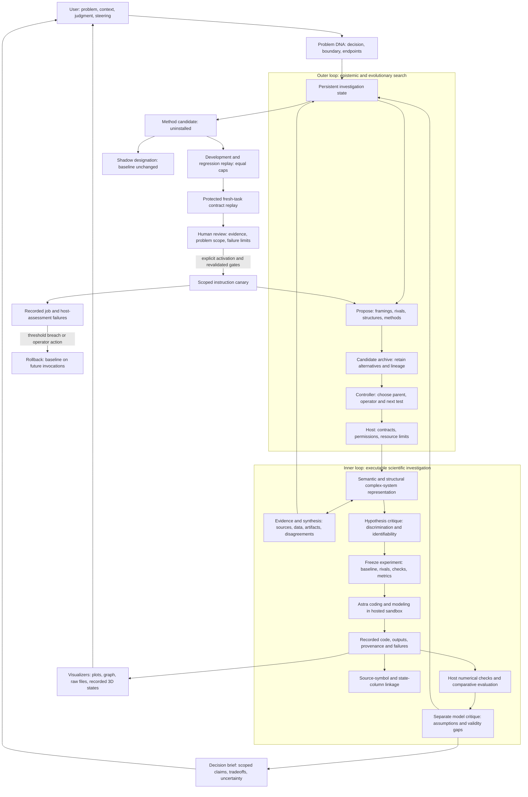
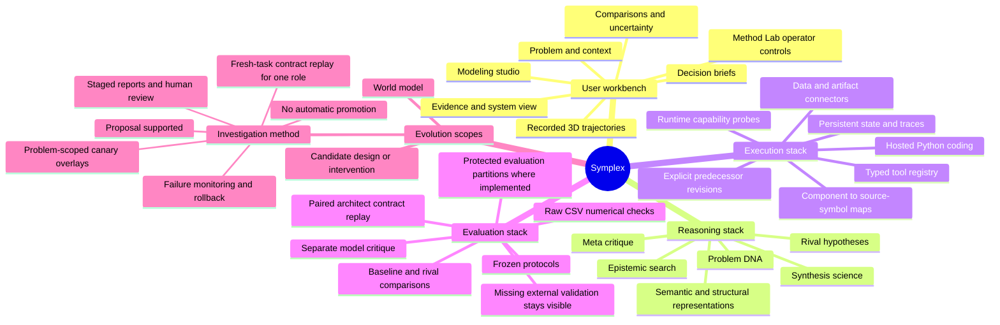

# Symplex — complex-system problem solving

Symplex uses Astra to search for useful explanations and representations, make them executable, test their consequences, and choose what to investigate next. The outer loop chooses the investigation; the inner loop does the evidence, modeling and computation. Neither loop establishes scientific truth by itself.

Edges describe implemented responsibilities and conditional transitions; their presence does not mean a candidate has passed them. The method backend supports one complexity-architect instruction change and measures software-contract reliability only. Human review and canary activation are separate explicit actions. A feature being implemented does not mean it is validated for a particular scientific domain.

The implementation is arranged by responsibility:

- `agents/`: controller, search policy, scientific-cycle services, role prompts and input context.
- `modeling/`: typed complex-system contracts, scenario runtime, scene contracts and projections.
- `evidence/` and `connectors/`: admission, synthesis, source retrieval, data profiling and hosted compute.
- `evaluation/`: frozen experiments, numerical checks, source linkage, execution assessment and paired method replay.
- `infrastructure/` and `observability/`: SDK routing, accounting, storage, execution boundaries, reviewed method registry, canary monitoring and traces.
- `interfaces/`: API and browser workbench; `tests/`: behavior and failure-path regression tests.

The search design draws on [MAP-Elites](https://arxiv.org/abs/1504.04909), which retains quality across niches, and [AlphaEvolve](https://deepmind.google/blog/alphaevolve-a-gemini-powered-coding-agent-for-designing-advanced-algorithms/), which evaluates explicit executable candidates and uses their results to guide subsequent proposals. Symplex’s generic archive currently uses host numerical-check coverage as a software-quality proxy. It is not a scientific-accuracy score or evidence of superior problem solving.

Three forms of improvement remain distinct: a better representation of the world, a better proposed intervention, and a better reusable investigation method. The architect replay compares frozen parent and candidate prompts on newly supplied tasks using matching settings and equal persistent caps. The registry checks development, regression and held-out reports in order, rejects paired regressions, and requires a held-out contract gain. Incomplete accounting makes a report inconclusive. Detailed replay inputs and outputs stay outside the originating problem's agent context, which receives only aggregate results.

Method Lab shows those recorded gates and exposes explicit review, shadow, canary and rollback controls. Shadow records do not run additional comparisons. An approved canary applies only to its problem allowlist and future invocations; its version participates in solver job identity. Execution failures and failed host assessments trigger rollback at reviewed limits. These controls do not measure scientific utility, semantic novelty or broad operational drift, and no candidate is automatically promoted.

Component maps provide a separate structural check: each component names an existing saved Python symbol or an omission, and mapped state outputs name actual CSV columns. Source digests bind these links to the recorded run. This does not prove that the symbol executed or correctly implements the declared mathematics.
